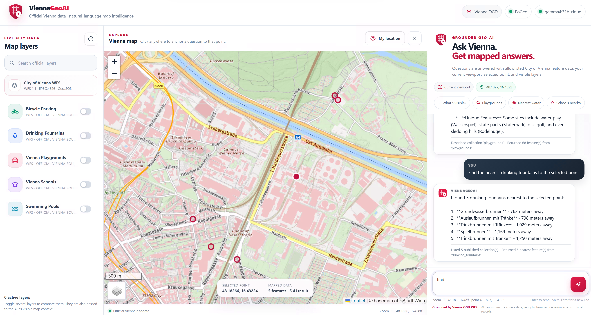

<p align="center">
  
</p>

<h1 align="center">ViennaGeoAI</h1>

<p align="center"><strong>Ask Vienna's map. Get grounded, mapped answers.</strong></p>

<p align="center">
  Natural-language GeoAI · official Vienna OGD/WFS · PoGeo tool calling · Ollama · Leaflet
</p>

<p align="center">
  <a href="https://github.com/vtavakkoli/ViennaGeoAI/actions/workflows/ci.yml"></a>
  <a href="LICENSE"></a>
  <a href="https://github.com/vtavakkoli/PoGeo"></a>
  
  
</p>

<p align="center">
  
</p>

ViennaGeoAI is an open-source geospatial AI application built on [PoGeo](https://github.com/vtavakkoli/PoGeo). It combines official City of Vienna Open Government Data, an interactive Leaflet map, explicit map context, and an Ollama tool-calling model.

Instead of asking an LLM to infer spatial facts from map pixels, ViennaGeoAI lets the model choose from validated geospatial tools and grounds answers in GeoJSON features retrieved from allowlisted data sources.

> **Project status:** active engineering/research prototype. The default Docker Compose setup is intended for local development and demonstration, not an internet-facing production deployment.
>
> **Independence:** ViennaGeoAI uses official City of Vienna open data but is **not an official City of Vienna application or service**.

## Highlights

- **Grounded GeoAI:** spatial answers come from configured geospatial tools and source features, not free-form geographic guessing.
- **Professional map workspace:** dedicated official-data, map, and AI panels with a responsive layout.
- **Multi-layer exploration:** display several Vienna datasets simultaneously.
- **Map-aware context:** viewport, zoom, selected point, and visible collections accompany each question.
- **Official Vienna WFS 1.1 / GeoJSON:** CRS-qualified `EPSG:4326` bounding-box queries.
- **Safe provider model:** no arbitrary SQL or arbitrary WFS URLs are exposed to the LLM.
- **Host Ollama integration:** defaults to `gemma4:31b-cloud` through the local Ollama API.
- **Reproducible PoGeo core:** the application pins a verified PoGeo revision instead of silently following a floating branch.
- **Docker hardening:** non-root application user, read-only filesystem, health checks, bounded requests, and internal PostGIS.
- **Live CI smoke test:** builds the Compose stack and verifies a real Vienna WFS query.

## Architecture

```text
Browser
  │
  ├── ViennaGeoAI UI
  │     ├── official layer explorer
  │     ├── Leaflet map + selected point
  │     └── grounded AI chat
  │
  ▼
PoGeo API
  │
  ├── validated geospatial tools
  │      └── City of Vienna WFS 1.1
  │             data.wien.gv.at
  │
  └── Ollama /api/chat
         │
         ▼
host.docker.internal:11434
         │
         ▼
 gemma4:31b-cloud
```

Vienna-specific configuration, UI, and deployment stay in this repository. Generic WFS/provider behavior, MCP/REST tooling, spatial-query logic, and Ollama agent behavior belong in PoGeo.

## Verified Vienna layers

The current allowlist exposes these City of Vienna feature types:

| Layer | Vienna WFS feature type |
|---|---|
| Playgrounds | `ogdwien:SPIELPLATZPUNKTOGD` |
| Schools | `ogdwien:SCHULEOGD` |
| Bicycle parking | `ogdwien:FAHRRADABSTELLANLAGEOGD` |
| Drinking fountains | `ogdwien:TRINKBRUNNENOGD` |
| Swimming pools | `ogdwien:SCHWIMMBADOGD` |

The application uses WFS **1.1.0**, `EPSG:4326`, and `application/json`. PoGeo sends map windows in the verified CRS-qualified form:

```text
16.30,48.17,16.44,48.27,EPSG:4326
```

The final CRS value is important for the current Vienna GeoServer spatial filtering behavior.

## Grounding and trust model

ViennaGeoAI separates three responsibilities:

1. **The user/map supplies context** — viewport, zoom, selected point, and enabled layers.
2. **The model chooses an allowlisted tool** — it cannot invent a WFS endpoint or execute arbitrary SQL.
3. **PoGeo retrieves structured geodata** — the answer is generated from returned source features and can be mapped back into the UI.

This design improves traceability, but LLM summaries can still be incomplete or misleading. For consequential decisions, verify the underlying source data.

## PoGeo revision policy

ViennaGeoAI pins the PoGeo core so Docker builds are reproducible.

Current verified revision:

```text
f3d4e02f2415182b9a85f9cf6a00be1209d047b1
```

When adopting a newer PoGeo revision, update `POGEO_REF` intentionally and let CI re-run the live Vienna integration test before merging.

## Quick start

### Requirements

- Docker with Docker Compose
- Ollama installed and running on the host
- an Ollama account with access to the configured model
- network access to the City of Vienna WFS and selected basemap providers

### 1. Verify Ollama

Windows PowerShell:

```powershell
Invoke-RestMethod -Uri "http://localhost:11434/api/generate" `
  -Method Post `
  -ContentType "application/json" `
  -Body (@{
    model="gemma4:31b-cloud"
    prompt="Why is the sky blue? Return only JSON with short_answer and explanation."
    format="json"
    stream=$false
  } | ConvertTo-Json)
```

ViennaGeoAI itself uses Ollama's `/api/chat` endpoint because the application needs conversation history and tool/function calling.

> `gemma4:31b-cloud` is an Ollama Cloud model. The Ollama daemon/API is local on your machine, while inference for that model is cloud-backed.

### 2. Configure

```bash
cp .env.example .env
```

Important defaults:

```dotenv
APP_PORT=8080
OLLAMA_BASE_URL=http://host.docker.internal:11434
OLLAMA_MODEL=gemma4:31b-cloud
POGEO_REF=f3d4e02f2415182b9a85f9cf6a00be1209d047b1
```

Do not commit `.env`; it is intentionally ignored by Git.

### 3. Build and start

```bash
docker compose up --build -d
```

Open:

```text
http://localhost:8080
```

For a first build after changing the pinned PoGeo revision:

```bash
docker compose down
docker compose build --no-cache app
docker compose up -d
```

## Using ViennaGeoAI

1. Toggle one or more official Vienna layers in the data panel.
2. Move the map to the area you want to investigate.
3. Click the map when your question is relative to a specific point.
4. Ask a natural-language question.
5. Inspect returned source features directly on the map.

Example questions:

```text
Show playgrounds and drinking fountains visible in this area.
```

```text
Which schools are closest to the selected point?
```

```text
Compare bicycle parking with playground availability in the current viewport.
```

```text
Find the nearest drinking fountains to this point and map the results.
```

## Health checks and troubleshooting

Check the application, AI path, and data catalog independently:

```powershell
Invoke-RestMethod http://localhost:8080/health
Invoke-RestMethod http://localhost:8080/api/ai/status
Invoke-RestMethod http://localhost:8080/collections
```

Test Vienna WFS through ViennaGeoAI:

```powershell
Invoke-RestMethod "http://localhost:8080/collections/playgrounds/items?bbox=16.30,48.17,16.44,48.27&limit=3"
```

A healthy Ollama call does **not** imply the Vienna WFS path is healthy, and vice versa. The frontend deliberately reports those failures separately.

### If logs still show a four-value WFS BBOX

Old behavior:

```text
bbox=16.30,48.17,16.44,48.27
```

Expected behavior:

```text
bbox=16.30,48.17,16.44,48.27,EPSG:4326
```

Rebuild without cache and verify the installed PoGeo revision:

```bash
docker compose build --no-cache app
docker compose run --rm --no-deps app cat /usr/local/share/viennageoai-pogeo-ref
```

## Configuration reference

| Variable | Default | Purpose |
|---|---|---|
| `APP_PORT` | `8080` | published web port |
| `OLLAMA_MODEL` | `gemma4:31b-cloud` | tool-calling model |
| `OLLAMA_BASE_URL` | `http://host.docker.internal:11434` | host Ollama daemon from Docker |
| `OLLAMA_TIMEOUT_SECONDS` | `300` | AI request timeout |
| `WFS_TIMEOUT_SECONDS` | `30` | Vienna WFS timeout |
| `MAX_FEATURES` | `5000` | global WFS feature cap |
| `MAX_TOOL_ITERATIONS` | `6` | maximum agent tool-loop iterations |
| `POGEO_REF` | pinned commit | verified PoGeo revision used by the image |

## Repository layout

```text
config/collections.yaml              Vienna WFS allowlist
web/index.html                       application shell
web/styles.css                       responsive visual system
web/app.js                           map, layers, status, and chat client
web/assets/*.svg                     ViennaGeoAI logo and favicon
ViennaGeoAI_Screenshot.png           README application screenshot
compose.yaml                         runtime stack
Dockerfile                           pinned PoGeo application image
.github/workflows/ci.yml             live integration smoke test
.github/ISSUE_TEMPLATE/              structured issue forms
CONTRIBUTING.md                      contribution workflow
SECURITY.md                          vulnerability reporting policy
CITATION.cff                         software citation metadata
LICENSE                              Apache License 2.0
NOTICE                               project and third-party attribution note
```

## Security

The default application enforces several boundaries:

- remote WFS endpoints are catalog-controlled
- feature properties are allowlisted
- arbitrary SQL is not exposed to the model
- arbitrary WFS URLs are not exposed to the model
- result counts and tool iterations are bounded
- WFS and Ollama calls have explicit timeouts
- the app container runs as a non-root user
- the application filesystem is read-only at runtime
- `no-new-privileges` is enabled
- PostGIS remains internal to the Compose network

For vulnerability reporting and supported versions, see [SECURITY.md](SECURITY.md).

For a public deployment, add TLS, user authentication/authorization, rate limiting, persistent audit logs, secret management, and explicit egress controls.

## Contributing

Contributions are welcome. Please read [CONTRIBUTING.md](CONTRIBUTING.md) before opening a pull request and follow [CODE_OF_CONDUCT.md](CODE_OF_CONDUCT.md).

A useful rule of thumb:

- Vienna-specific UI, configuration, datasets, and deployment changes → **ViennaGeoAI**
- generic WFS/provider, MCP, REST, spatial-query, or agent behavior → **PoGeo**

## Citation

Citation metadata is provided in [CITATION.cff](CITATION.cff), which GitHub can render through **Cite this repository**.

Suggested software citation:

> Tavakkoli, V. ,& Mohsenzadegan, K. (2026). *ViennaGeoAI: Grounded Natural-Language Access to Vienna Geospatial Open Data*. GitHub repository.

If you publish a paper or derived benchmark using ViennaGeoAI, cite the exact commit or release used so the software configuration is reproducible.

## License and third-party data

ViennaGeoAI source code and project-owned assets are licensed under the [Apache License 2.0](LICENSE). See [NOTICE](NOTICE) for attribution notes.

The Apache-2.0 license **does not relicense external services or datasets**. Feature data, map tiles, model services, third-party names, and trademarks remain subject to their respective terms. In particular, review the applicable City of Vienna OGD, basemap.at, OpenStreetMap, Ollama, and model-provider terms before redistribution or production use.

## Related project

**[PoGeo](https://github.com/vtavakkoli/PoGeo)** — the reusable AI-native geospatial API, WFS/provider, MCP, REST, and Ollama tool-calling core used by ViennaGeoAI.
